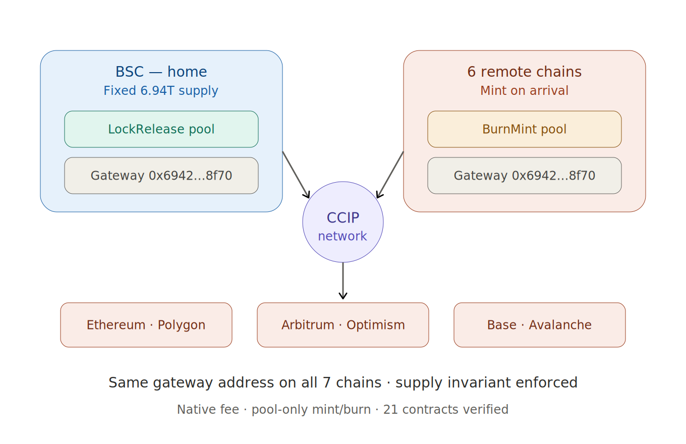

# MolePin Devlog

A builder's journal documenting the development of **MolePin (MOL)** — a fixed-supply omnichain MemeFi token, live across 7 EVM chains via Chainlink CCIP, built and operated solo.

The failures are in here on purpose. So is everything I'd do the same way again.

---

## The one rule everything serves

Every design decision serves a single invariant: **the total supply of MOL, across every chain, always equals 6,942,420,888,888.** Bridging moves MOL between chains. It never mints new MOL out of thin air, and it never destroys it.

BSC is the home chain and holds the entire fixed supply via a LockRelease pool. The six remote chains — Ethereum, Polygon, Arbitrum, Optimism, Base, Avalanche — run BurnMint pools that mint on arrival and burn on departure. The amount locked on BSC always equals the total circulating across the remotes.

---

## Articles

Long-form engineering essays — the stories behind the build.

| # | Article | What it covers |
|---|---------|----------------|
| 01 | [I Rebuilt Everything After the Audit](./articles/01-rebuilt-after-audit.md) | Why I threw away the deployment and redeployed clean after Beosin |
| 02 | [Why I Left LayerZero for Chainlink CCIP](./articles/02-why-i-left-layerzero.md) | Not a technical verdict — an operating-model one for a solo builder |
| 03 | [The Same Code Behaved Differently on Every Chain](./articles/03-same-code-behaved-differently.md) | Multi-chain deployment as an accounting problem |

---

## Engineering notes

Shorter technical notes, organized by topic:

- [`cross-chain/`](./cross-chain) — deployment accounting, bridge model, gas lessons
- [`tokenomics/`](./tokenomics) — supply design, multi-chain allocation
- [`old-contracts/`](./old-contracts) — archived experimental contract versions (builder history)

---

## What's verified

The token economy is audited by **Beosin** (Report No. 202606191626). Twenty-one contracts — tokens, gateways, and pools across all seven chains — are source-verified on every block explorer. The bridge has been tested live in every direction, and the supply invariant has been checked transaction by transaction.

Contracts and tests live in [`molepin-contracts`](https://github.com/molepin/molepin-contracts). This repo is the story of building them.

---

*Read the series. Verify the contracts. Add up the supply yourself. — Roy*
