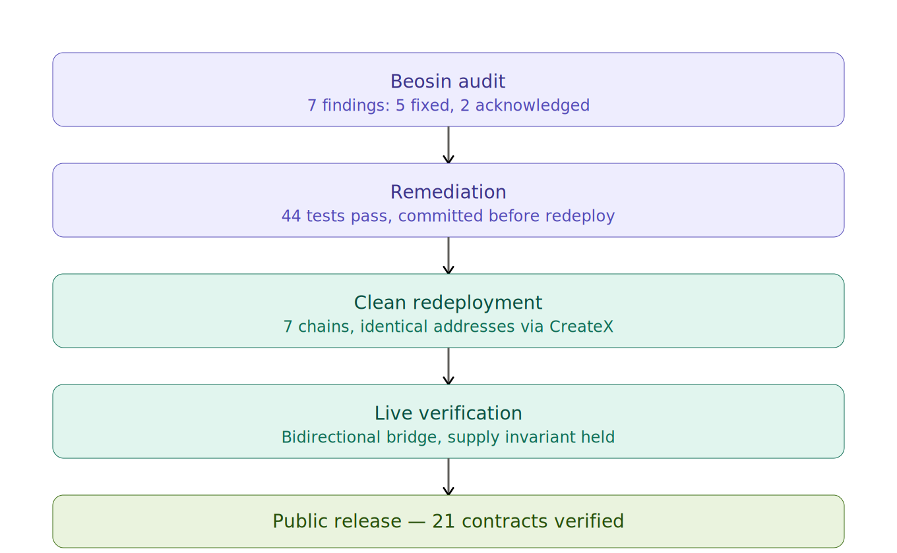
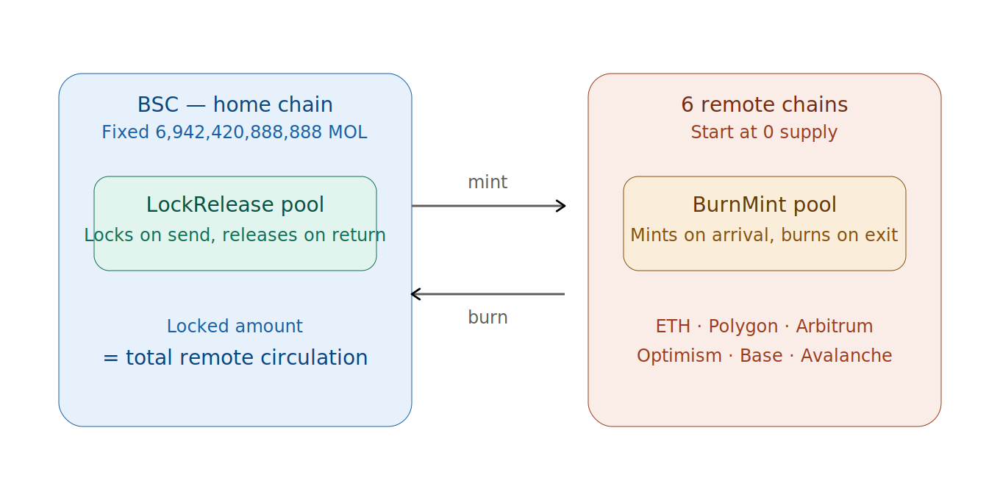
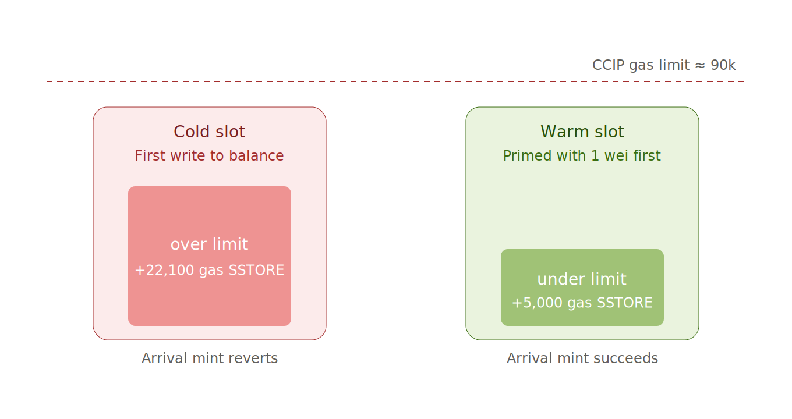

# I Rebuilt Everything After the Audit

When the Beosin report came back, I did something that surprised a few people I talked to: I threw away the deployment and started over.

Not the code — the code had been audited, fixed, and committed. I threw away the *deployment*. Every contract address, on all seven chains, gone. Then I redeployed the whole thing from a clean slate.

This is the story of why, and what I learned doing it.

---

## The audit changed less than I feared, and more than I expected

Beosin returned seven findings — three medium, two low, two informational. Five I fixed. Two I acknowledged.

The number that mattered to me wasn't seven. It was the *kind* of findings. None of them said "your supply can be inflated" or "anyone can drain the pool." They were the quieter, structural kind — the sort that don't break anything today but become landmines later.

Two stuck with me.

**Finding #03** was about ownership transfer. When ownership moved, an admin role wasn't being kept in sync. On its own, harmless. But I have a roadmap that goes from a single owner key to a multisig. That migration is *exactly* the moment finding #03 would have detonated — transfer ownership to a Safe, and quietly lose an admin role in the process. Fixed.

**Finding #07** restricted `grantMintAndBurnRoles` to the admin role. This one had a consequence I didn't anticipate until I was deep in redeployment: it meant the pool deployment itself had to be signed by the admin wallet, not the deployer. A small rule on paper that reshaped how I sequenced the entire redeploy.

Forty-four tests passed. I committed the fixes. And then, instead of patching the live deployment, I deleted it.

---

## Why redeploy instead of patch?

Here's the thing about a deployment that was done *before* an audit closed: you can never fully trust its provenance.

My live contracts had been deployed during development. They'd seen test transactions, half-finished wiring, abandoned pool attempts, roles granted and revoked while I figured things out. The audited *source* was clean. But the deployed *instances* carried the fingerprints of every experiment that came before.

I have a principle I keep coming back to: **finish completely, with no procedural defects.** A contract that works but carries a murky history isn't finished — it's just functional. And "functional" is the standard for a prototype, not for something people will put money into.

So: clean slate. New deployer transaction, new salt, audited bytecode, nothing else. If someone traces my deployment history, every step should be deliberate.

The cost was real — redeploying seven chains means redoing tokens, gateways, pools, role grants, CCIP registration, the full mesh of cross-chain lanes, and every gateway trust relationship. Days of work to recreate something that already "worked."

I'd do it again without hesitating.

---

## The one thing redeployment is not allowed to break

Across all of this, there's a single invariant I will not violate: **the total supply of MOL, summed across every chain, always equals 6,942,420,888,888.** Bridging moves MOL. It never creates or destroys it.

The way this works: BSC is the home chain and holds the entire fixed supply. When you bridge MOL off BSC, a LockRelease pool *locks* it. On the destination chain, a BurnMint pool *mints* a 1:1 representation. Bridge back, and the remote tokens burn while the BSC pool releases the originals.

The invariant is simple to state and unforgiving to verify: **the amount locked in the BSC pool must always equal the total circulating supply across all six remote chains.** After redeployment, I checked it transaction by transaction. Send 10 MOL to Polygon, the BSC pool locks 10. Send 5 back, it releases 5. The numbers held exactly.

This is also *why* the clean redeploy mattered. An invariant is only as trustworthy as the deployment enforcing it. I didn't want to defend "the supply is fixed" on top of a deployment I couldn't fully account for.

---

## The trap that bit me — again

Every multi-chain builder eventually meets the gas limit on the destination side of a bridge. I'd met it before. I met it again here, and it's worth explaining because it's so unintuitive.

When a cross-chain message arrives, the destination executes automatically within a gas budget — for CCIP, around 90,000 gas. Mostly that's plenty. Except when it isn't.

The culprit is *cold storage*. The first time a contract writes to a storage slot — say, the very first time the gateway's balance increases — the EVM charges a cold-write penalty of about 22,100 gas. That penalty, stacked on top of the normal arrival logic, can push the whole thing over 90k. The mint reverts. The tokens don't arrive. And there's no obvious error pointing at "your storage slot was cold."

The fix is almost silly: write to the slot once, ahead of time, with a tiny amount. Now the slot is "warm." The next write — the real one, during a bridge — costs about 5,000 gas instead of 22,100. Suddenly you're comfortably under the limit.

I call this priming. After redeployment I primed every remote token (so the first mint wouldn't pay a first-write penalty on total supply) and every gateway (so the balance slot was warm on arrival). Seven chains, a wei at a time.

Then I sent the first real bridge transfer — BSC to Polygon, 10 MOL. It arrived in about a minute. Status: Success. The same transfer that had failed before, now landing clean, because of a few wei of priming.

---

## Verified, top to bottom

The last step was making all of it checkable by anyone. Twenty-one contracts — tokens, gateways, and pools across seven chains — source-verified on every explorer. The audited commit, the committed code, and the on-chain bytecode are the same thing. You don't have to trust me. You can read it.

That's the whole point of rebuilding instead of patching. Not because the patch wouldn't have worked — it probably would have. But because "it works" was never the bar. The bar was: finished, accountable, and verifiable, with no step I couldn't explain.

The audit didn't just find seven issues. It gave me a reason to make the deployment as clean as the code.

---

*MolePin (MOL) is a fixed-supply omnichain MemeFi token live across 7 EVM chains via Chainlink CCIP. Contracts are audited by Beosin and source-verified on every chain. — Roy*
