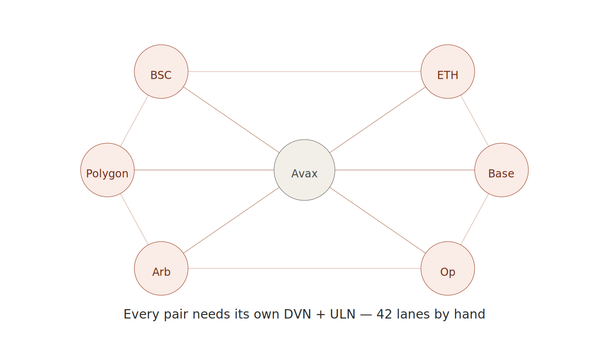
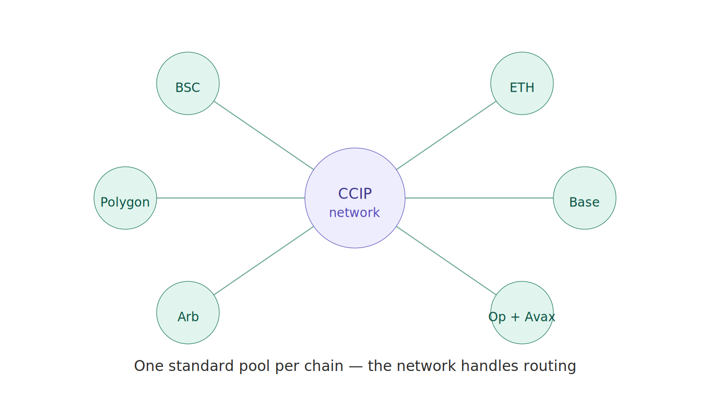

# Why I Left LayerZero for Chainlink CCIP

I want to be clear about something before I start: LayerZero is good technology. I didn't leave because it couldn't do the job. I left because of who I am — one person, running this alone.

That distinction turned out to matter more than any technical benchmark.

---

## The wiring was the problem, not the bridging

When you build an omnichain token on LayerZero, you're responsible for the security configuration of every path between every pair of chains. You choose the DVNs — the decentralized verifier networks that attest to your messages. You configure the ULN — the layer that defines how messages are verified and executed. And you do this *per lane*.

A lane is one direction between two chains. With seven chains, the number of lanes isn't seven. It's seven times six. Forty-two.

Forty-two lanes, each needing DVN selection, each needing ULN configuration, each needing to be set and then *maintained* as the network evolves. For a team with a dedicated infrastructure engineer, that's a Tuesday. For me, it was a slowly growing weight I could feel every time I added a chain.

The math is the trap. Every new chain doesn't add one unit of work — it adds a *row and a column* to the matrix. Chain number eight wouldn't have meant one more lane. It would have meant fourteen more. The burden grows with the square of my ambition.

I kept doing it. It kept working. But "it works and I personally hold the whole mesh in my head" is not a sustainable operating model. It's a single point of failure wearing a t-shirt that says *the single point of failure is me*.

---

## What Chainlink CCT changed

Chainlink's Cross-Chain Token standard inverts the relationship. Instead of me wiring every pair, each chain registers *one* standard token pool with the CCIP network. The network handles routing between them.

Look at the two pictures side by side and you can feel the difference before you read a single label. LayerZero was a star of forty-two hand-drawn threads radiating between every node. CCIP is a hub: each chain reaches the network once, and the network does the rest.

The work didn't vanish — nothing ever does. I still deploy a pool on each chain, register it, set up the mesh of supported chains, configure rate limits. But the *shape* of the work changed from "maintain N² hand-wired security paths" to "register N standard components with a network that handles the connections." That's a difference a solo operator can live inside.

There's a subtle point here that took me a while to articulate. The question was never "which protocol is more powerful." Both can move a token across chains. The question was "which operating model survives me being one person with finite attention." LayerZero gives you more control, and more control means more surface to maintain. CCIP gives you a standard, and a standard means the maintenance is shared with everyone who uses it.

---

## The honest tradeoff

I'm not going to pretend this was free. Moving to CCT meant giving up some of the fine-grained control LayerZero offers. If I wanted an exotic verification setup, a custom DVN mix tuned per lane, LayerZero is where I'd go. CCT asks you to accept the standard.

For me, accepting the standard *was* the feature. I don't want to tune forty-two lanes. I want a token economy that I can reason about, verify, and hand off to a multisig someday without a 40-page runbook on how the security mesh is wired.

There's a version of engineering maturity that's about doing less, deliberately. Choosing the boring standard over the powerful custom thing, because the boring standard is the one you can still operate at 2am when something breaks and you're the only one awake.

Leaving LayerZero wasn't a verdict on LayerZero. It was a verdict on what I can sustainably carry alone.

---

*MolePin (MOL) is a fixed-supply omnichain MemeFi token live across 7 EVM chains via Chainlink CCIP. Built and operated solo. — Roy*
