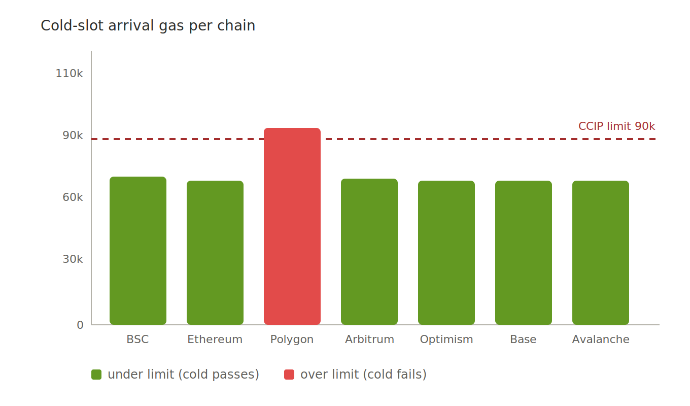
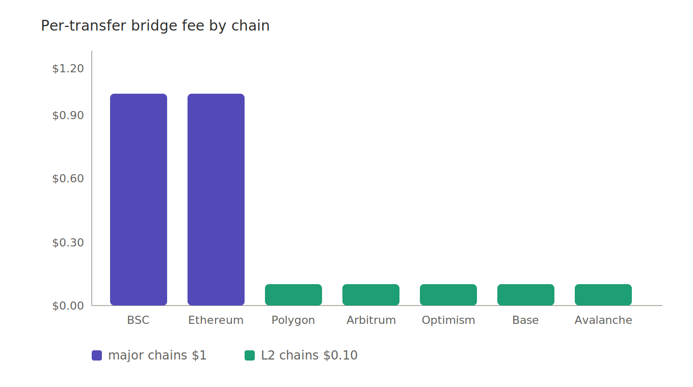

# The Same Code Behaved Differently on Every Chain

I used to think a smart contract was a fixed object. You write it, you compile it, you deploy it, and it does the same thing everywhere. The bytecode is identical, after all.

The bytecode *is* identical. The behavior is not. And the gap between those two facts is where I spent some of my most confusing hours.

---

## One chain crossed the line. Six didn't.

Here's the specific thing that broke my mental model.

When a bridged token arrives on a destination chain, the receiving logic has to execute inside a gas budget — roughly 90,000 gas for CCIP's automatic execution. If the arrival logic costs more than that, it reverts. The tokens don't land.

I measured the cost of an arrival on each of my seven chains, in the worst case — when the relevant storage slot was *cold*, paying the first-write penalty. Same contract. Same operation. Here's what I found.

Six chains sailed under the limit even in the cold state. Polygon — and only Polygon — crossed it. Same bytecode. Same logic. One chain over the line, six under.

I want to sit on that for a second, because it broke something in how I thought. I had been treating "the gas cost of my contract" as a property of my contract. It isn't. It's a property of my contract *times the specific chain it's running on*. Polygon's gas accounting, at that particular boundary, pushed an operation over a cliff that the same operation cleared comfortably everywhere else.

You cannot find this by reading your Solidity. The Solidity is the same. You find it by measuring, per chain, and being willing to believe a number that contradicts your assumption that "deployed once, behaves everywhere."

---

## Deployment stopped being about Solidity

At the start of this project, I believed smart contract development was mostly about Solidity. Write good contracts, the rest follows.

By the end, deployment had quietly become an *accounting* problem. Not accounting in the token-supply sense — accounting in the sense of: every chain has its own gas economics, its own native token, its own quirks at the margins, and you have to keep a ledger of all of it in your head.

The cold-slot discovery is one entry in that ledger. Here's another: fees.

---

## Why the fee isn't one number

My instinct was to charge one bridge fee everywhere. One number, fair, simple. That instinct was wrong, and the reason is the same as the gas story: chains aren't interchangeable.

A fee that feels right on Ethereum — where everything is expensive and users expect to pay — feels extortionate on an L2 where the whole point is that things are cheap. A fee that feels right on an L2 looks like a rounding error on Ethereum. One number can't be correct in both places.

So I tiered it. One dollar on BSC and Ethereum, the major chains where users expect real fees. Ten cents on the five L2s, where cheapness is the entire value proposition. The fee is collected in each chain's native token — never deducted from your MOL — so the token stays clean and the cost lives where it belongs.

This isn't a pricing trick. It's an admission that "the same fee everywhere" is a fiction that only sounds fair until you look at what a chain actually costs to use.

---

## The ledger in your head

The lesson I keep relearning: a multi-chain deployment is not one thing deployed seven times. It's seven slightly different environments that happen to accept the same bytecode.

The cold slot on Polygon. The native token you need for gas on each chain. The decimals that differ between a token on one chain and the "same" token on another. The finality time that makes Polygon transfers take fifteen minutes and Arbitrum ones take seconds. None of this is in your contract. All of it is in the gap between your contract and the chain it runs on.

I started this thinking I was a Solidity developer. I ended it realizing I was keeping a seven-column ledger, and that the ledger — not the Solidity — was the actual hard part.

---

*MolePin (MOL) is a fixed-supply omnichain MemeFi token live across 7 EVM chains. Audited by Beosin, verified on every chain. — Roy*
