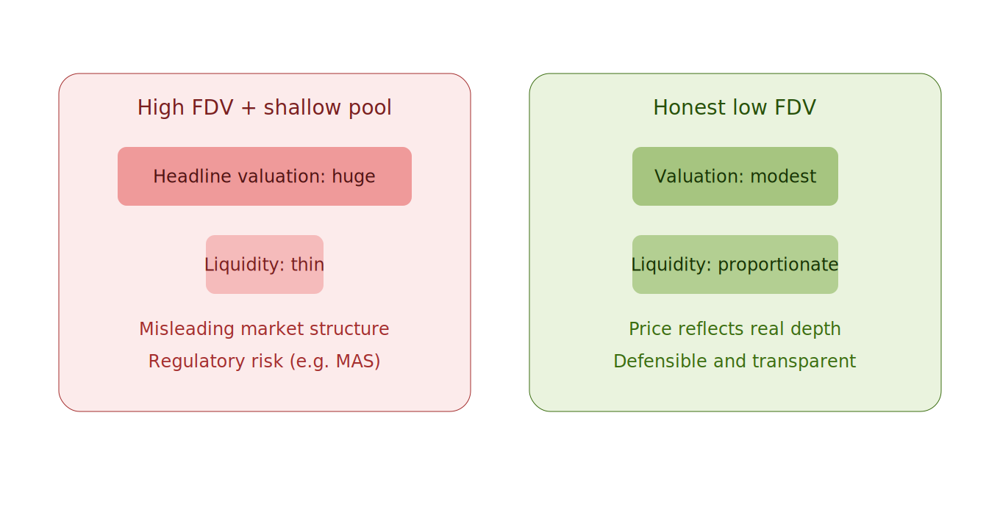
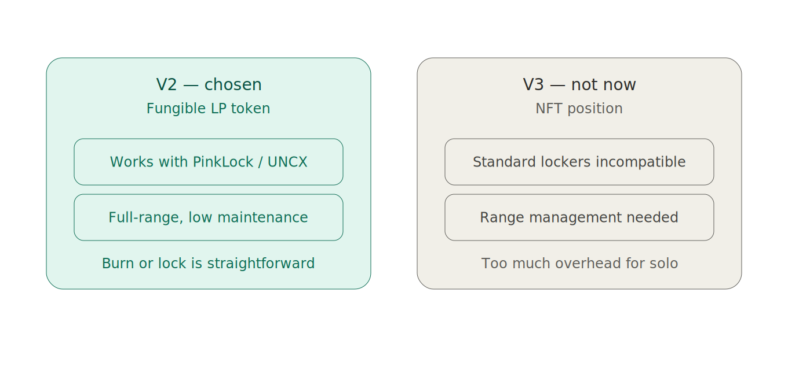
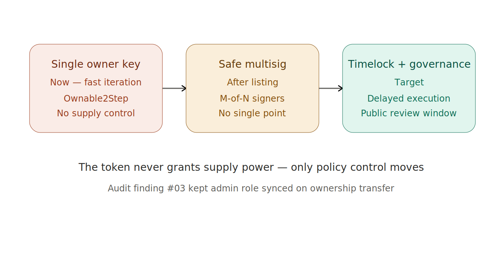

# The Decisions I Made Before Listing

The contracts are live, audited, and verified. The bridge works in every direction. The hard engineering is behind me. And yet the decisions that have kept me up most recently aren't technical at all — they're about how to bring this to a market honestly.

Three of them mattered enough to write down.

---

## Decision 1: Honest valuation over a flattering one

There's a move that's so common in token launches it almost looks like the default: launch at a high fully diluted valuation, back it with a shallow liquidity pool, and let the headline number do the marketing. A huge FDV looks impressive. A thin pool is cheap to seed. On paper, you've launched a billion-dollar token for the price of a used car.

I'm not doing that. Here's why.

A high FDV on a shallow pool isn't just optimistic — it's *misleading by construction*. The valuation implies a depth of market that the liquidity doesn't support. The first real sell order moves the price violently, because there was never enough liquidity to justify the number in the first place. Anyone who bought the headline gets hurt by the structure.

There's also a regulatory dimension I take seriously. I operate in a jurisdiction with an active financial regulator. A market structure that's *designed* to present a misleading picture of value isn't a clever launch tactic — it's the kind of thing regulators describe with words I don't want in the same sentence as my project.

So: an honest, low FDV, with liquidity proportionate to it. The valuation will be modest. It will also be *real* — the price will reflect actual market depth, and it'll be defensible to anyone who looks closely. I'd rather launch a small honest thing than a large misleading one.

---

## Decision 2: PancakeSwap V2, not V3

This one looks like a purely technical choice, and it started as one, but it ended up being about something deeper: what a solo operator can credibly promise.

V3 is the more advanced AMM — concentrated liquidity, capital efficiency, the works. My instinct was to use the newer thing. Then I hit a wall that has nothing to do with how good V3 is.

In V2, your liquidity position is a *fungible LP token* — a standard ERC-20. That means the standard liquidity-lock tools, PinkLock and UNCX, can lock it. Locking liquidity is how you prove to the market that you can't rug it. It's one of the most important trust signals a small project can give.

In V3, your position is an *NFT*. The standard lockers don't support it the way they support fungible LP tokens. And concentrated liquidity needs active range management — you're not just providing liquidity, you're maintaining a position. For a team, fine. For one person who also needs to sleep, it's a standing liability.

So V2. The less fancy choice is the one that lets me lock liquidity with a standard tool, prove I can't rug, and not babysit a range. The trust signal matters more than the capital efficiency.

---

## Decision 3: Start with one key, but design for the multisig

The contracts are owned, right now, by a single key. That makes some people nervous, and I understand why. So let me be precise about what that key can and can't do — and where it's going.

First, what it *can't* do: the owner key has no power over supply. It can't mint MOL. It can't touch your balance. It can't pause transfers or freeze your tokens. The token contract is deliberately pure — all the policy lives in a separate gateway, and even there, the supply invariant is enforced in code, not by trust. The scariest powers simply don't exist in the system.

What the key *can* do is administrative — configure the gateway, set fees, manage the bridge routes. Real, but bounded.

The plan is a single key now, for fast iteration during launch, moving to a Safe multisig after listing, with a timelock and broader governance as the target. Each step removes a single point of failure without ever introducing a new power over your tokens.

This is exactly where the audit earned its keep. One of Beosin's findings was about keeping an admin role synchronized during ownership transfer. That sounds like a footnote until you realize it's *the migration I'm about to do* — moving ownership to a multisig. If that role had desynced in the process, I'd have handed control to a Safe and silently broken something. Fixed before it could ever happen.

---

## The pattern underneath all three

Looking at these together, they're the same decision wearing three costumes. Honest FDV over flattering FDV. Lockable V2 over fancy V3. A trust path that only ever *removes* power, never adds a scary one.

Every one of them trades a short-term advantage — a bigger headline, a newer AMM, faster unilateral control — for something a stranger can verify and trust. That's the whole posture of this project. The token can't inflate. The liquidity can be locked. The control only ever decentralizes. None of it requires you to trust me, which is the only kind of trust worth offering.

The engineering was the part I knew how to do. These decisions were the part I had to get right.

---

*MolePin (MOL) is a fixed-supply omnichain MemeFi token live across 7 EVM chains via Chainlink CCIP. Audited by Beosin, verified on every chain. — Roy*
