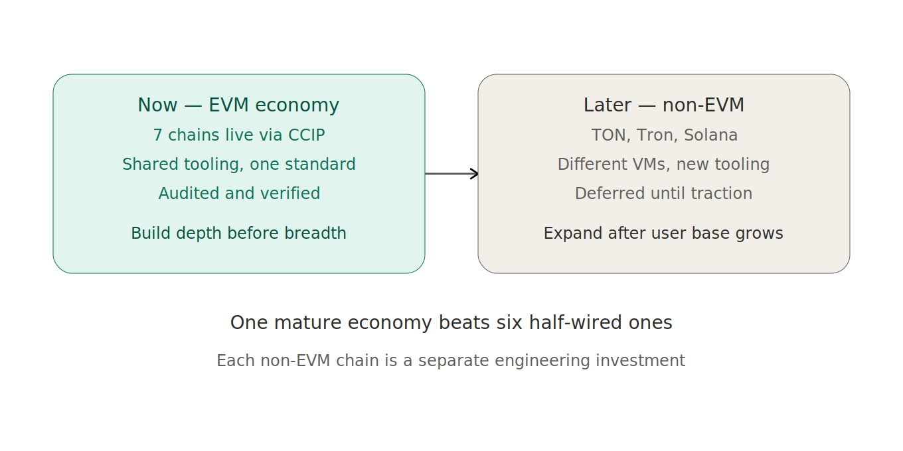

# Note: Why EVM First, Non-EVM Later

People ask why MolePin isn't on TON, or Tron, or Solana yet. It's a fair question — those chains have real users and real momentum. The answer is a deliberate sequencing decision, not an oversight.

The seven chains MolePin lives on today are all EVM chains. That's not a coincidence — it's the entire point of the current phase. Because they share the EVM, they share tooling, share the CCIP standard, share the same contract code deployed at the same address. One mental model covers all seven. One audit covers the shared logic. The marginal cost of the seventh EVM chain was small, because it ran the same machinery as the first.

Non-EVM chains break that. TON has its own virtual machine and its own language. Tron is EVM-adjacent but different enough to matter. Solana is a completely different execution model. Each one isn't "add a chain" — it's "build a second implementation, audit it separately, maintain it separately." For a solo operator, each non-EVM chain is a whole new engineering investment, not an incremental one.

So the strategy is depth before breadth. Build one mature, audited, verified EVM economy that actually works and actually has users — before spreading thin across execution models I'd have to support one at a time. A single token economy that's solid beats six that are each half-wired and under-maintained.

The non-EVM chains aren't cancelled. They're sequenced. After traction, when there's a user base that justifies the separate investment and ideally some help to share the load, they go back on the table. Until then, the focus is making the EVM side undeniable.

One mature economy first. Expansion after it earns the right.

---

*Part of the MolePin devlog. — Roy*
