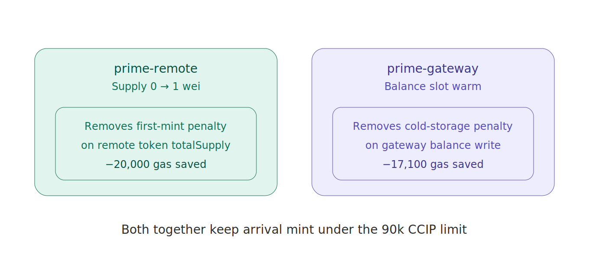

# Note: Two Kinds of Priming

In the audit article I mentioned "priming" the contracts before going live, and described it as warming up cold storage slots. That's true, but it glosses over something: there are actually *two* priming steps, and they fix two different problems. Worth separating.

**prime-remote** addresses the first-mint penalty. The very first time a remote token's `totalSupply` moves off zero, the EVM charges a first-write penalty on that storage slot. If that first write happens during a real bridge arrival, it stacks onto the arrival cost and risks blowing the gas budget. So I do it ahead of time: mint a single wei to warm the supply slot. Now the *real* first user-facing mint pays the cheap, warm price.

**prime-gateway** addresses the gateway's balance slot. The gateway holds tokens transiently during a bridge. The first time its balance slot is written, same story — cold-write penalty. So I warm it the same way, with a wei, before any real traffic.

Both are the same trick — write once cheaply now so the real write later is cheap — but on different slots, preventing different penalties. The remote one protects against the first-mint cost on the token. The gateway one protects against the cold-storage cost on the gateway's transient balance.

Why split hairs about this? Because when I was debugging arrival failures, I initially primed only one of them and was confused that some transfers still flirted with the gas limit. The slots are independent. Warming one doesn't warm the other. You need both, on every chain, to keep arrival comfortably under the 90k CCIP execution budget.

Two slots. Two penalties. Two primes. A wei each.

---

*Part of the MolePin devlog. — Roy*
