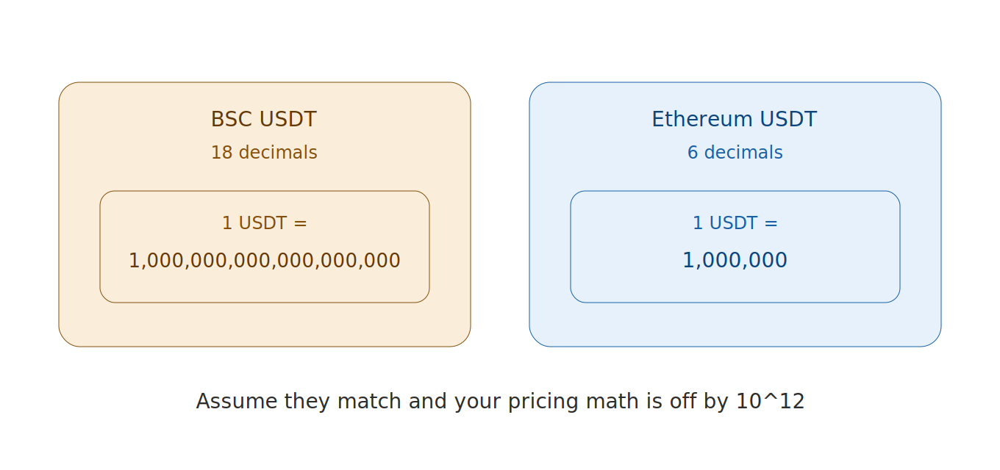

# Note: The BSC USDT Decimals Trap

A short one, because it's the kind of thing that's obvious in hindsight and catastrophic in the moment.

When I was preparing the DEX listing, I had to handle USDT. And I had a reflex, built from working on Ethereum, that USDT has 6 decimals. It does — on Ethereum. On BSC, it doesn't.

BSC's USDT uses **18 decimals**. Ethereum's uses **6**. The "same" token, the same ticker, a different internal representation by a factor of 10^12.

This matters because every price calculation, every liquidity ratio, every "how much USDT equals this much MOL" computation depends on getting the decimals right. Assume 6 when it's 18, and your numbers are off by a trillion. Not "a bit wrong" — wrong by twelve orders of magnitude. The kind of wrong that, in a listing context, drains a pool or prices a token at zero.

The lesson isn't really about USDT. It's about a dangerous category of bug: the one where the thing *looks* identical across chains but isn't. The ticker is the same. The name is the same. The contract interface is the same. Only the decimals differ, silently, and only if you check.

So now I check decimals explicitly, on-chain, for every token I touch on every chain, and I never carry an assumption about "how many decimals X has" across a chain boundary. The token tells you. Ask it.

---

*Part of the MolePin devlog. — Roy*
